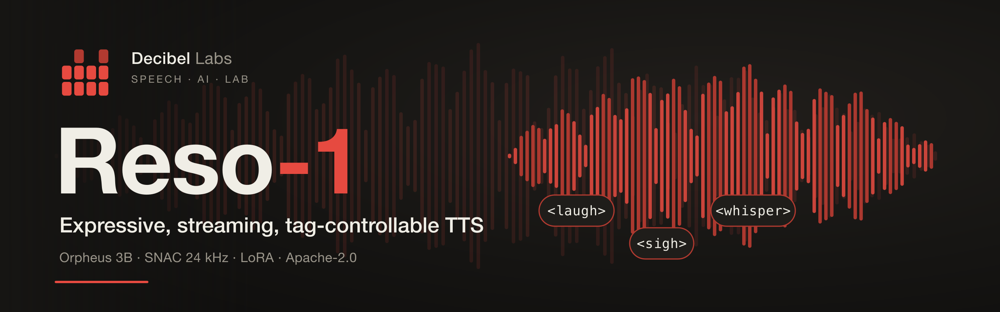

<p align="center">
  
</p>

# reso-tts

Training pipeline for **Reso** voice models — expressive, streaming,
tag-controllable TTS by Decibel Labs. Teacher distillation → LoRA
fine-tunes of Llama+SNAC architecture models (Orpheus 3B, 24kHz).

## Status

| | |
|---|---|
| prompts/v1 English corpus (16,213 utterances, 6 categories) | ✅ |
| Teacher synthesis — 8,105 clips, ElevenLabs v3, 24kHz | ✅ |
| QC (Whisper WER + rate + tag events): 7,342 pass / 8.87 h | ✅ |
| run01: LoRA r=64 on orpheus-3b, 3 epochs, loss 3.47 | ✅ |
| Eval: 198 heldout + 10 fresh samples, 0 degenerate | ✅ |

## Layout

```
prompts/v1/       versioned text corpus (arctic, harvard, general,
                  normalization, prosody dialogues, tags, edge) + manifest
scripts/          numbered pipeline stages:
                  build_prompts_v1 → 00_synthesize_teacher → 05_filter_qc
                  → 03_encode_snac → 04_make_splits → train_lora
                  → generate_eval → say_local (Mac demo) → 90_pack_audio
data/             synth_state.db (source of truth), metadata/, qc/
                  (audio dirs gitignored — never commit audio)
splits/           train.jsonl / heldout.jsonl (diagnostic, per-category)
checkpoints/      run_config + eval samples tracked; weights gitignored
release/          HF model card + publishing checklist
```

## Quickstart (local demo, M-series Mac)

```bash
python3 -m venv .venv && ./.venv/bin/pip install -r requirements.txt
./.venv/bin/pip install llama-cpp-python snac torch
./.venv/bin/python scripts/say_local.py "Hey! <laugh> it runs locally."
# needs checkpoints/reso1_orpheus3b_run01/reso1-q4_k_m.gguf (not in git)
```

Tags: `<laugh> <chuckle> <sigh> <gasp> <whisper> <pause>` inline in text.
Prompt convention: `reso: <text>` (baked into training). Generation needs
`repetition_penalty >= 1.1`.

## License

[Apache 2.0](LICENSE) — same license as the base models.
Attributions in [NOTICE](NOTICE).
